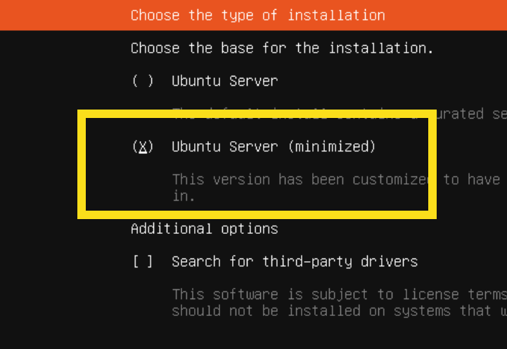

# NERD:Autobox A VM for Network Automation Labbing

This toolkit includes the following: 

* Linux VM (Ubuntu 24.04 in this case)
* Code Server (VS Code running as a web application)
* Ansible (free, open source version)
* Containerlab 
* Arista cEOS-based Lab Topology (9 nodes, "medium" sized topology)
* * 2 spines
* * 4 leafs
* * 2 "hosts" (cEOS devices)
* * 1 external router  


## Requirements for Medium Topology (9 nodes)

* 4 vCPUs 
* 16 GB of RAM
* 60 GB of storage

The original requirement was 8 vCPUs, but I've been running on 4 vCPUs in one of my environments with a full EVPN/VXLAN fabric running, and CPU utilization is low. My processor is an AMD 5950x on a hypervisor, so the core speeds aren't super high, so I think this should work for a variety of platforms on 4 vCPUs. 

## Installing Linux

While you can use just about any Linux distribution you like (there're several hundred to choose from), I normally use Alma Linux (a derivitive of Red Hat Enterprise Linux/RHEL). But these are instructions for Ubuntu, which is another popular distro used in network automation. If you use a different Linux, then the instructions will of course be quite different.  

You can use any hypervisor that you like. I've been playing with Proxmox, but any general purpose hypervisor should work (KVM, VMware/ESXi, HyperV, etc.). Keep in mind VMware (now Broadcom) has discontinued the free version of ESXi, hence why I'm using the free version of Proxmox.

## Installing Linux

* Download the latest ISO image for 24.04 (https://ubuntu.com/download/server)

Do a standard install and select "Ubuntu Server (minimized)" for the type of installation. 



When the system boots up, log in as the user and update and upgrade components: 

```
sudo apt update
sudo apt -y upgrade
```

## Install Components

Run this script to install the various components needed (Ansible, Python pip, git, etc.)

curl -fsSL https://raw.githubusercontent.com/tonybourke/Project-NERD/refs/heads/main/Autobox/enable_ubuntu_https.sh > enable_ubuntu_https.sh ; bash enable_ubuntu_https.sh