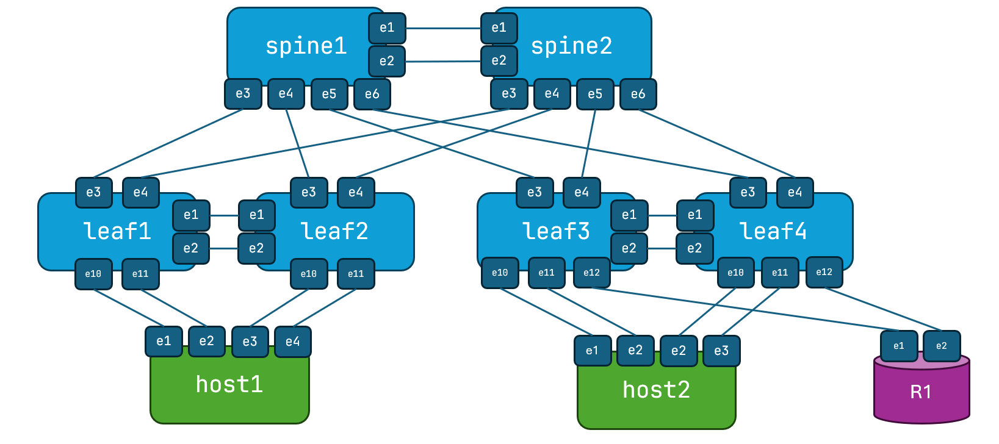

# The NERD Project

The <ins>N</ins>etwork <ins>E</ins>ngineering <ins>R</ins>esource for <ins>D</ins>evelopment. Project NERD. 

What is project NERD? It's a collection of tutorials and accompanying artifacts (files, playbooks, scripts, etc.) to build certain types of VMs and containers that aid in network automation, specifically labing of network automation. 

The instructions are geared towards home labs, but they can be used as the basis for production builds. 

These toolkits should provide an environment to explore network automation with containerlab, VS Code (as a web app), and Ansible (and/or Python).  One of the challenges for a lot of networking people is setting up such an environment. There's lots of instructions around, but I've yet to see a single set of instructions for building all of these pieces together. I think that creates a lot of friction for the many networking people who aren't as used to tools of the system administrator trade (Linux, Linux CLI, etc.)

## The Autobox (All In One Automation System)

The introductory NERD Box is an all-in-one automation lanbing platform called The Autobox. It runs containerlab with a leaf/spine topology with full data and control plane (Arista cEOS), Ansible, a built-in IDE (VS Code running as a webapp), and Python. It's everything you need to play with network automation. You can also install just about anything on top of it. 

Using the instruction you'll have a VM with the following: 

* AlmaLinux 9.5
* Python 3.9
* Code-server (VS Code running as a web application)
* Ansible for automating the environment
* Containerlab
* Docker CE (Community Edition, free)
* Containerlab Arista cEOS Topology

Instructions to build the Autobox: [Autobox](Autobox)

## The BASE Box (Linux and Code Server)

The <ins>B</ins>ase <ins>A</ins>utomation <ins>S</ins>ystem for <ins>E</ins>engineers. The BASE Box. 

The BASE Box is just the basics: Linux, Python, Ansible, and Code Server. You can add anything on top of this of course, but it's a good starting point. 

[BASE Box](BASE%20Box)
